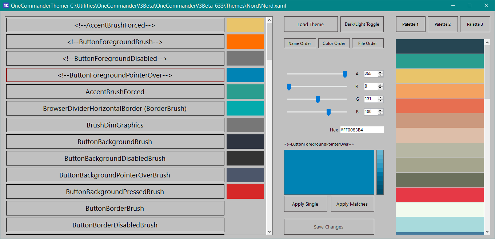

# OneThemer

This application has been designed to help customise existing OneCommander themes visually - rather than modifying xaml in a text editor.\
The focus is purely on color changes, so for other theme changes you'll still need to get your hands dirty :)
\
\
How to use:  
Download and unzip the main file\
Launch OneThemer.exe\
The main screen will be shown:

Load Themem - Load a OnceCommander xaml theme

Dark/Light Toggle - When modifying a light or dark theme it's often easier to match the UI required. So click the Dark/Light Toggle button as appropriate

Palatte 1,2,3 - These are sample palettes of colors that should work well together

Name Order / Color Order / File Order - Sort the items in the main list

A R G B Sliders / Edit boxes - Alpha (transparency), Red, Green, Blue hex entries for the currently selected value in the list

Apply Single - Update the color change for the selected value in the list

Apply Matches - Update all entries that share the same color as the selected value in the list

Save changes - Saves the changes to the selected theme file and creates a backup of the original

\
\
When you select an item from the left hand list it appears in the middle section. 
Vertically next to this in the narrow column are shown minor color changes (ligher and darker) - any can be clicked
Alternatively select a color from one of the palette entries and tweak using this sliders.
\
Hovering over the entries in the left hand list shows a tooltip giving extra info on what the entry represents

